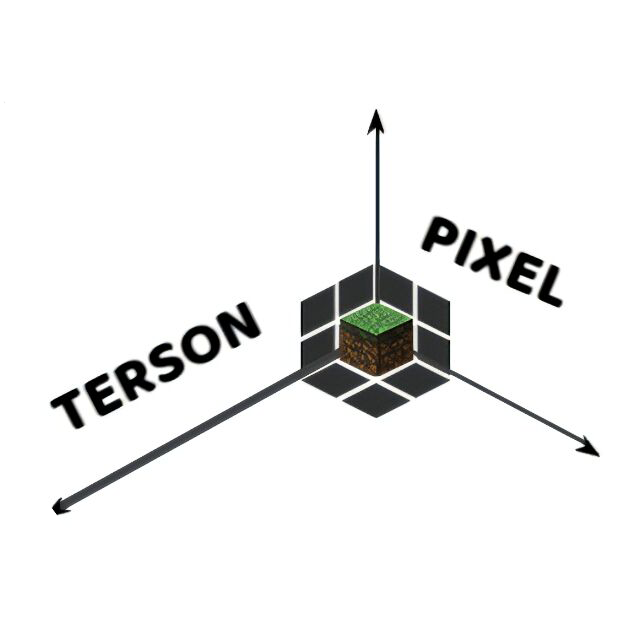

## 这个库是干嘛的？
- 顾名思义，这是一个为愿意参与服务器未翻译插件翻译的玩家提供的仓库。在您翻译完成后，可以依照此文件中提供的方法提交至此仓库。你的 `Pull request` 被合并后后就会被应用到服务器内

## 如何参与翻译？
- 查看 `翻译要求` 与 `注意事项` 以免翻车
- `Fork` 此项目
- 克隆你 `Fork` 过后的你自己的仓库到本地，或者直接在线修改
- 将 `Translating` 文件夹中的内容进行翻译，并在翻译完成后将文件移至 `Completed` 文件夹中
- 将更改提交至你自己的仓库中
- 向此仓库提交 `Pull request`，记得给提交打个 `Label` 啊

## 翻译有问题/翻译不全/有没有被收录到这里的未翻译插件该怎么办？
- 交个 `Issue` 就行，不过记得要打个 `Label` 啊
- 如果是翻译错误，可以在提交 `Issue` 后自行更改并提交 `Pull request`，提交步骤与参与翻译的步骤几乎相同。当然，不交 `Issue` 也是可以的，但前提是你要提交 `Pull request` 来修复这个错误

## 翻译要求
- 尽量不使用机器翻译。如果你真的想使用的话，请确保不会出现什么逆天翻译...
- 尽量准确并确保玩家能够理解。
- 被保留的其他语言部分、参数、数字等与中文字符前后间需要有 1 个空格的距离
- 不要去除参数，特殊情况除外
- 文件内的注释可以不翻译，但请不要去除
- 请尽量保持格式统一

## 注意事项
- 在你的 `Pull request` 被合并后，则代表你同意我们在服务器中使用你提交的翻译文本
- 我们假定你熟悉各种操作，如并不熟悉，请利用您的搜索引擎
- 翻译前看看原仓库，别重复翻译或者翻译完成后发现 `Pull request` 交不上去...
- 文中 "此插件对应的文件夹" 一般指与此插件同名的文件夹
- 在翻译完 `Translating` 文件夹中某个插件的所有文件后，请将对应此插件的文件夹及和翻译完成的文件一并移动到 `Completed` 文件夹中。并确保翻译后的文件在对应此插件的文件夹中
- 如果你仅完成了部分文件的翻译，在移动文件时，如果 `Completed` 文件夹中已有此插件对应的文件夹，请移动到那个文件夹中。如果没有，请自行创建一个并移动到其中。
- ~~如果你使用黑色背景查看此文件，也许最上面的图片看起来会有些奇怪，这是因为我不咋会用 PS，整的很烂（~~

## 关于
- 为什么会有这个项目？~~不还是因为管理组不是没时间就是懒β（或者都有），谁都不愿意全翻译了嘛...~~
- 本项目暂不遵循任何开源协议，如需使用此项目中的文本，取得翻译文本的作者的同意即可
- 贡献者？ 看右边的 `Contributors` 就行。在此对为此项目做出贡献的所有人表示感谢！
